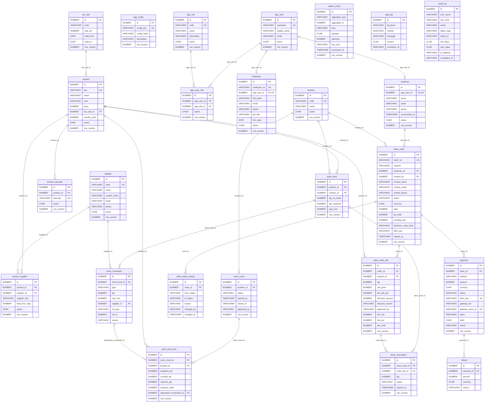

```mermaid
erDiagram
    app_role {
        NUMBER id PK
        VARCHAR2 code UK
        VARCHAR2 name
        VARCHAR2 description
        CHAR active
        NUMBER row_version
    }

    app_config {
        NUMBER id PK
        VARCHAR2 config_key UK
        VARCHAR2 config_value
        VARCHAR2 description
        NUMBER row_version
    }

    location {
        NUMBER id PK
        VARCHAR2 code UK
        VARCHAR2 name
        CHAR active
        NUMBER row_version
    }

    tax_rate {
        NUMBER id PK
        VARCHAR2 code
        NUMBER rate_pct
        DATE valid_from
        DATE valid_to
        NUMBER row_version
    }

    supplier {
        NUMBER id PK
        VARCHAR2 code UK
        VARCHAR2 name
        VARCHAR2 contact_name
        VARCHAR2 email
        VARCHAR2 phone
        CHAR active
        NUMBER row_version
    }

    app_user {
        NUMBER id PK
        VARCHAR2 username UK
        VARCHAR2 display_name
        VARCHAR2 email
        CHAR active
        NUMBER row_version
    }

    app_user_role {
        NUMBER id PK
        NUMBER app_user_id FK
        NUMBER app_role_id FK
        CHAR active
        NUMBER row_version
    }

    employee {
        NUMBER id PK
        VARCHAR2 employee_no UK
        NUMBER app_user_id FK,UK
        VARCHAR2 full_name
        VARCHAR2 email
        VARCHAR2 phone
        VARCHAR2 job_title
        DATE hire_date
        CHAR active
        NUMBER row_version
    }

    customer {
        NUMBER id PK
        NUMBER app_user_id FK,UK
        VARCHAR2 name
        VARCHAR2 email
        VARCHAR2 phone
        TIMESTAMP anonymized_at
        CHAR active
        NUMBER row_version
    }

    product {
        NUMBER id PK
        VARCHAR2 sku UK
        VARCHAR2 name
        VARCHAR2 uom
        NUMBER price
        NUMBER tax_rate_id FK
        NUMBER reorder_point
        CHAR active
        NUMBER row_version
    }

    product_barcode {
        NUMBER id PK
        NUMBER product_id FK
        VARCHAR2 barcode UK
        CHAR active
        NUMBER row_version
    }

    product_supplier {
        NUMBER id PK
        NUMBER product_id FK
        NUMBER supplier_id FK
        VARCHAR2 supplier_sku
        NUMBER lead_time_days
        CHAR active
        NUMBER row_version
    }

    stock_level {
        NUMBER id PK
        NUMBER product_id FK
        NUMBER location_id FK
        NUMBER qty_on_hand
        NUMBER qty_reserved
        NUMBER avg_cost
        NUMBER row_version
    }

    stock_movement {
        NUMBER id PK
        NUMBER stock_level_id FK
        VARCHAR2 type
        NUMBER qty
        NUMBER unit_cost
        NUMBER supplier_id FK
        VARCHAR2 ref_type
        NUMBER ref_id
        VARCHAR2 reason
    }

    sales_order {
        NUMBER id PK
        VARCHAR2 order_no UK
        VARCHAR2 channel
        NUMBER customer_id FK
        NUMBER location_id FK
        VARCHAR2 contact_name
        VARCHAR2 contact_email
        VARCHAR2 contact_phone
        VARCHAR2 status
        CHAR currency
        NUMBER total
        NUMBER tax_total
        NUMBER rounding_adj
        VARCHAR2 handover_code_hash
        VARCHAR2 idem_key
        TIMESTAMP expires_at
        NUMBER row_version
    }

    sales_order_line {
        NUMBER id PK
        NUMBER order_id FK
        NUMBER product_id FK
        NUMBER qty
        NUMBER unit_price
        NUMBER tax_rate_pct
        NUMBER discount_amount
        VARCHAR2 discount_reason
        VARCHAR2 approved_by
        NUMBER line_net
        NUMBER line_tax
        NUMBER line_total
        NUMBER row_version
    }

    stock_reservation {
        NUMBER id PK
        NUMBER stock_level_id FK
        NUMBER order_line_id FK
        NUMBER qty
        VARCHAR2 status
        TIMESTAMP expires_at
        NUMBER row_version
    }

    order_status_history {
        NUMBER id PK
        NUMBER order_id FK
        VARCHAR2 from_status
        VARCHAR2 to_status
        VARCHAR2 reason
        VARCHAR2 changed_by
        TIMESTAMP changed_at
    }

    payment {
        NUMBER id PK
        NUMBER order_id FK
        VARCHAR2 method
        NUMBER amount
        CHAR currency
        VARCHAR2 status
        VARCHAR2 idem_key UK
        VARCHAR2 gateway_ref
        VARCHAR2 gateway_event_id UK
        VARCHAR2 token
        CHAR last4
        VARCHAR2 brand
        NUMBER row_version
    }

    refund {
        NUMBER id PK
        NUMBER payment_id FK
        NUMBER amount
        CHAR currency
        VARCHAR2 reason
    }

    outbox_event {
        NUMBER id PK
        VARCHAR2 aggregate_type
        NUMBER aggregate_id
        VARCHAR2 type
        CLOB payload
        NUMBER attempts
        VARCHAR2 last_error
        TIMESTAMP processed_at
        NUMBER row_version
    }

    cycle_count {
        NUMBER id PK
        NUMBER location_id FK
        VARCHAR2 status
        TIMESTAMP opened_at
        TIMESTAMP closed_at
        VARCHAR2 approved_by
        NUMBER row_version
    }

    cycle_count_line {
        NUMBER id PK
        NUMBER cycle_count_id FK
        NUMBER product_id FK
        NUMBER snapshot_qty
        NUMBER counted_qty
        NUMBER variance_qty
        NUMBER variance_value
        NUMBER adjustment_movement_id FK
        NUMBER row_version
    }

    app_log {
        NUMBER id PK
        VARCHAR2 log_level
        VARCHAR2 module
        VARCHAR2 message
        CLOB context
        VARCHAR2 correlation_id
    }

    audit_log {
        NUMBER id PK
        VARCHAR2 user_name
        VARCHAR2 role_code
        VARCHAR2 action
        VARCHAR2 object_type
        VARCHAR2 object_id
        CLOB old_value
        CLOB new_value
        VARCHAR2 ip_address
        VARCHAR2 correlation_id
    }

    %% Security & User Relationships
    app_user ||--o{ app_user_role : "app_user_id"
    app_role ||--o{ app_user_role : "app_role_id"
    app_user |o--o| employee : "app_user_id"
    app_user |o--o| customer : "app_user_id"

    %% Catalog Relationships
    tax_rate ||--o{ product : "tax_rate_id"
    product ||--o{ product_barcode : "product_id"
    product ||--o{ product_supplier : "product_id"
    supplier ||--o{ product_supplier : "supplier_id"

    %% Inventory Relationships
    product ||--o{ stock_level : "product_id"
    location ||--o{ stock_level : "location_id"
    stock_level ||--o{ stock_movement : "stock_level_id"
    supplier ||--o{ stock_movement : "supplier_id"

    %% Ordering Relationships
    customer ||--o{ sales_order : "customer_id"
    location ||--o{ sales_order : "location_id"
    sales_order ||--o{ sales_order_line : "order_id"
    product ||--o{ sales_order_line : "product_id"
    stock_level ||--o{ stock_reservation : "stock_level_id"
    sales_order_line ||--o{ stock_reservation : "order_line_id"
    sales_order ||--o{ order_status_history : "order_id"

    %% Payment Relationships
    sales_order ||--o{ payment : "order_id"
    payment ||--o{ refund : "payment_id"

    %% Cycle Count Relationships
    location ||--o{ cycle_count : "location_id"
    cycle_count ||--o{ cycle_count_line : "cycle_count_id"
    product ||--o{ cycle_count_line : "product_id"
    stock_movement |o--o{ cycle_count_line : "adjustment_movement_id"
```